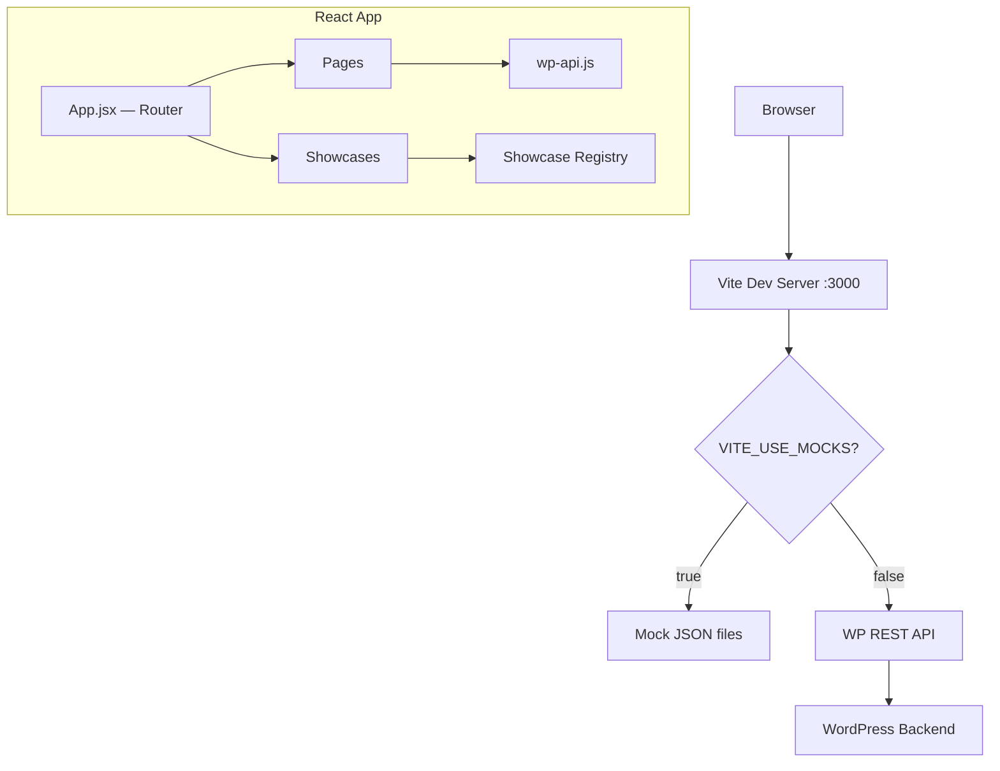

# Devonshire

A minimal React + Vite frontend for prototyping UX and headless WordPress.

## Quick Start

```bash
npm install
npm run dev
```

The dev server runs at [http://localhost:3000](http://localhost:3000).

## Features

- **Showcase gallery** — Browse and preview reusable UX pattern demos
- **Headless WordPress** — Fetches posts and pages from the WP REST API
- **Mock data** — Prototype without a live WordPress instance

## Adding a New Showcase

1. Create your component in `src/showcases/MyPattern.jsx`
2. Register it in `src/showcases/index.js`:

```js
import MyPattern from './MyPattern';

const showcases = [
  // ...existing showcases
  {
    id: 'my-pattern',
    title: 'My Pattern',
    description: 'A description of what this demo shows.',
    component: MyPattern,
  },
];
```

3. Visit `/showcases/my-pattern` to see it live.

## Connecting to WordPress

1. Copy `.env.example` to `.env`:
   ```bash
   cp .env.example .env
   ```

2. Update the values:
   ```
   VITE_WP_API_URL=https://your-site.com/wp-json/wp/v2
   VITE_USE_MOCKS=false
   ```

3. Restart the dev server. The app will now fetch content from your WordPress instance.

During development, the Vite proxy forwards `/wp-json` requests to your WordPress backend to avoid CORS issues.

## Architecture



## Project Structure

```
src/
├── api/
│   └── wp-api.js          # WP REST API fetch wrapper
├── mocks/
│   ├── posts.json          # Sample blog posts
│   └── pages.json          # Sample pages
├── pages/
│   ├── Home.jsx            # Landing page with hero + cards
│   ├── PostList.jsx         # Blog listing
│   ├── PostSingle.jsx       # Single blog post
│   └── PageView.jsx         # Single WP page
├── showcases/
│   ├── index.js             # Showcase registry
│   ├── CardGrid.jsx         # Card grid demo
│   ├── HeroSplit.jsx        # Split hero demo
│   ├── ShowcaseGallery.jsx  # Gallery listing
│   └── ShowcaseView.jsx     # Single showcase viewer
├── styles/
│   └── global.css           # Minimal CSS with design tokens
├── App.jsx                  # Root layout + routes
└── main.jsx                 # Entry point
```

## Tech Stack

- **React** 18 — UI library
- **React Router** 6 — Client-side routing
- **Vite** 5 — Build tool and dev server
- No CSS frameworks, no state management libraries — intentionally minimal.
